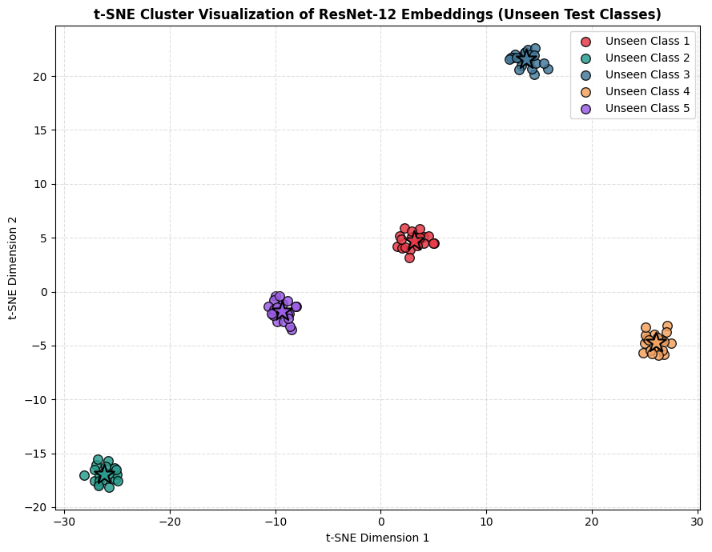

# Prototypical Networks (ProtoNet) with ResNet-12 on Omniglot

This repository contains a PyTorch implementation of **Prototypical Networks** for **Few-Shot Learning** on the **Omniglot** dataset, utilizing a **ResNet-12** architecture as the feature extractor (Encoder).

## 📝 Project Description
The goal of this model is to learn an embedding space where representations cluster around a single prototype vector for each class. At test time, the model classifies images from completely unseen categories given only 1 or 5 reference samples (shots).

## 🏗️ Architecture & Setup
- **Encoder:** ResNet-12 (4 Residual Blocks with 64, 128, 256, and 512 channels).
- **Metric:** Squared Euclidean Distance.
- **Optimizer:** Adam with StepLR scheduler.
- **Training Strategy:** Trained using a **20-way 1-shot** meta-learning setup with Data Augmentation (rotations and affine transforms) to maximize feature robustness.

## 📊 Evaluation Results
Evaluated over **1,000 randomized unseen test episodes** on the Omniglot dataset:

| Task | Accuracy | 95% Confidence Interval |
| :--- | :---: | :---: |
| **5-way 1-shot** | **96.56%** | ± 0.32% |
| **5-way 5-shot** | **99.17%** | ± 0.13% |

## 🖼️ Visual Analysis
- **t-SNE Visualization:** Feature clusters for unseen classes show clear separation in the 2D embedding space, demonstrating high intra-class compactness and inter-class margin.
- **Prototype Refinement:** The 5-shot scenario significantly improves accuracy (+2.61%) compared to 1-shot, confirming that averaging support vectors builds more stable class representations.

## 🚀 How to Run
1. Click the **Open in Colab** badge above to launch the notebook directly in Google Colab.
2. Change the runtime type to **GPU** (`Runtime -> Change runtime type -> T4 GPU`).
3. Run all cells sequentially. The Omniglot dataset will be downloaded automatically.

## 📜 Reference
- Snell, J., Swersky, K., & Zemel, R. (2017). *Prototypical Networks for Few-Shot Learning*. NeurIPS 2017.